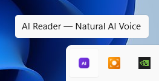
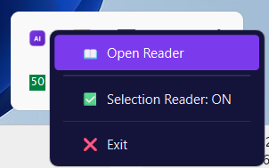
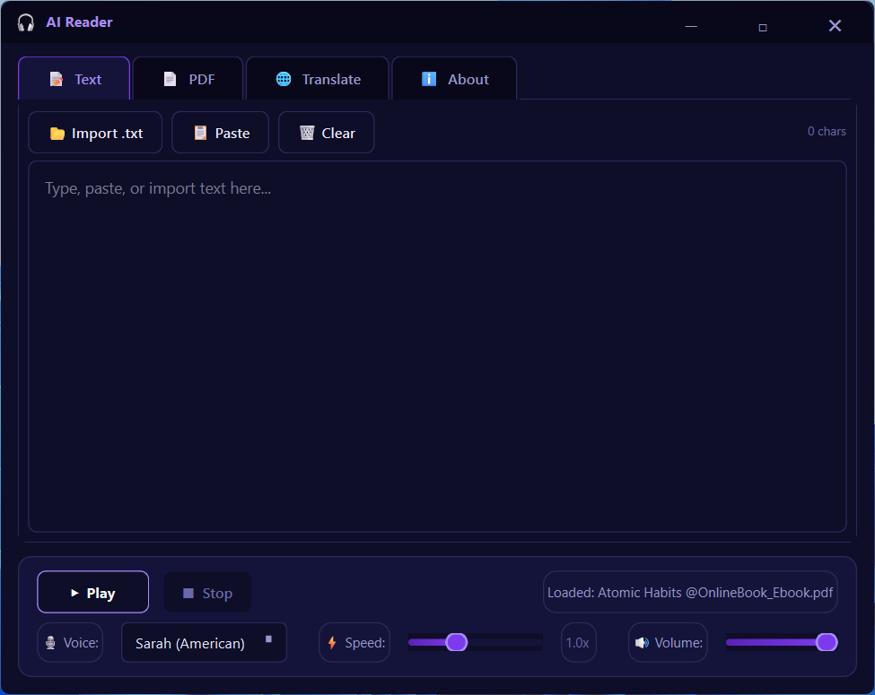
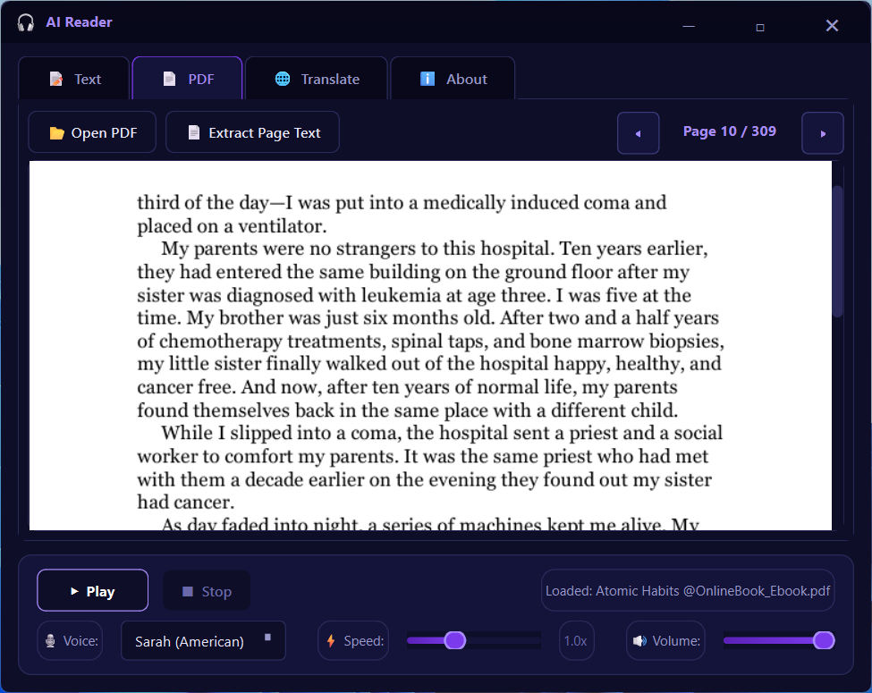
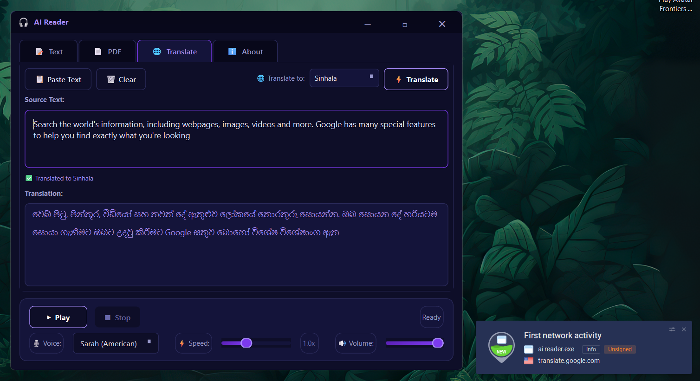

# AI Reader 🎧

AI Reader is a native Windows application designed for high-quality, natural-sounding AI text-to-speech (TTS). It provides a seamless reading experience with a focus on ease of use and modern aesthetics.


## Features ✨

- **Natural AI Voice**: Powered by Kokoro and ONNX Runtime for high-quality, offline TTS.
- **Selection Monitor**: Automatically captures selected text for instant reading.
- **Minial Interface**: Minimalist top-bar that appears when you move your mouse to the top of the screen.
- **System Tray Integration**: Runs quietly in the background; easily accessible from the system tray.
- **Support for Multiple Voices**: Load and switch between different AI voices.
- **Offline First**: All processing happens locally on your machine.

## How It Works 🛠️

1. **Initialization**: The app loads the AI engine (ONNX Runtime) first to ensure stability.
2. **Server**: A local TTS server starts to handle audio generation requests.
3. **UI**: A PyQt6-based interface provides controls via a system tray icon and a sliding top bar.
4. **Monitoring**: The app monitors your clipboard/selection to provide quick read-aloud functionality.

## Installation 🚀
### For Direct Users - [Direct Download link](https://drive.google.com/file/d/1BQXiuUQhtKrjRnCkpciJTFqjGDJmbgrI/view?usp=drive_link)
- Open the AI_Reader_Setup_v3.0 file.
- Install it normally.
- Once the installation is complete, click AI Reader to run it.
- When it is running, you can find it in the Windows system tray:

- Alternatively, a small popup will appear at the top of the screen when you move your mouse to the top edge:

- If you click it, the following UI popup will appear:

- To access the main application, go to the Windows system tray, right-click the icon, and select "Open Reader" (or simply double-click the icon).

- The Main Application Interface:

- If you need to read a PDF, add the file here, click "Extract Page Text," and then click the play button to start reading.

- If you need to translate anything, you can use this option. Several languages are available.

### ℹ️ If you change any settings, they will save automatically. When you open the application later, your previous settings will be loaded by default.
### 📌 While running, the application uses your computer's local resources to process the text. The processing time and reading speed depend entirely on your system's performance.
### ⚠️ When using a terminal, please turn off this button. This ensures it will not interfere with your work; otherwise, the terminal might unexpectedly close due to the [CTRL + C] command.


## Details about program
- Its natural voice reader is 100% offline.
- If you use the translation feature, it requires an internet connection, as it relies on Google Translate.


## For Developers
### Prerequisites
- Python 3.10+
- Windows (Optimized for DLL pre-loading and native behavior)

### Setup
1. Clone the repository:
   ```bash
   git clone <repository-url>
   cd AI_Reader
   ```
2. Create and activate a virtual environment:
   ```bash
   python -m venv venv
   .\venv\Scripts\activate
   ```
3. Install dependencies:
   ```bash
   pip install -r requirements.txt
   ```
4. Run the application:
   ```bash
   python main.py
   ```

## Development 🏗️

- `main.py`: Entry point and application lifecycle management.
- `server.py`: TTS server and Kokoro engine integration.
- `audio_player.py`: Handles audio playback and voice management.
- `selection_monitor.py`: Monitors text selection/clipboard.
- `ui/`: Contains PyQt6 UI components (Tray, Top Bar, Reader Window).

## License 📄
[Add License Here, e.g., MIT]
